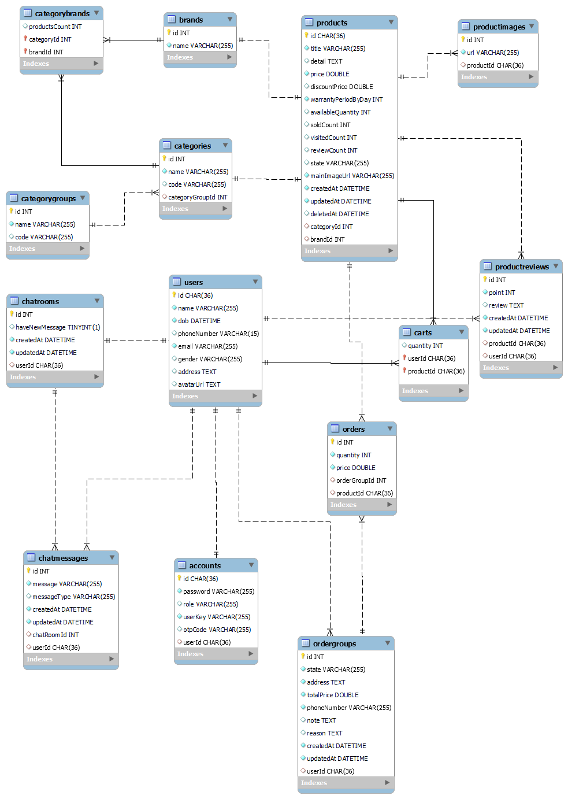

# Online sport equipment retail store

## Mô tả:

- Project backend api tự học cá nhân sử dụng công nghệ JavaScript, NodeJs, ExpressJs, Sequelize và SocketIO.

### Các chức năng chính

- Realtime chat using socketIO
- CRUD user, authorize user through jwt token
- CRUD products, filter product through category, brand or category group, upload product images
- CRUD product's review
- CRUD brand, category, categoryGroup
- CRUD user's cart
- CRUD order, manage order with state

### Các chức năng phụ

- Craw data using puppeteer
- Some basic test with jest and supertest
- Api docs using swagger (can be found at http://localhost:4000/api-docs)

### Mô hình Database

